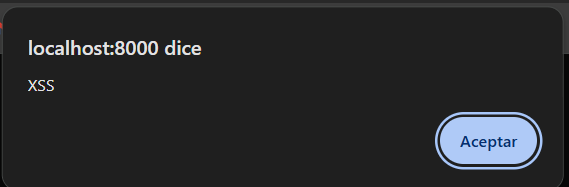

# Vulnerabilidades

## SQL Injection

El login de insecure-login es vulnerable a inyecciones sql:

El código vulnerable a SQL Injection se encuentra el fichero web en las rutas, y es vulnerable porque se están insertando directamente los datos del usuario dentro de la consulta (no validando carácteres como ", ', -- o ;), permitiendo a un atacante romper la lógica de la consulta:

## XSS

Redirigiéndonos al endpoint de welcome sin saber las credenciales del usuario registrado en la aplicación:

Como vemos nos dice que la página es vulnerable a XSS, y la vista anterior la única variable que tiene es la que viene después de Welcome mostrándonos el nombre del usuario logueado, de forma que revisando el código, no tiene protección a XSS ya que la variable no es un texto plano, sino JavaScript o HTML, peritiendo que se ejecuten scripts:

Para probar su vulnerabilidad, se me ha ocurrido llamar al usuario de la base de datos con un payload de XSS:

De forma que al loguearnos en la web, la variable users tendrá el valor de este payload mostrándonos una alerta en la web

El peligro del XSS es que un atacante puede obtener la cookie de sesión de un usuario logueado con scripts como hemos realizado anteriormente, permitiendo al atacante poder realizar acciones en el nombre del usuario robado.

# Mitigación

En el backend para corregir el error de insertar código sql desde el login he usado query builder con prepared statements:

Y en el frontend he puesto el campo de nombre email a tipo email:

Y ya con estos cambios esta vulnerabilidad la tendríamos solucionada.

## XSS

Y la vulnerabilidad XSS simplemente modificando la línea que mencione anteriormente:

De esta forma el contenido del nombre es interpretado como texto normal.

# Test

## SQL Injection

En el caso del test de SQL Injection hago un post en el endpoint, con el payload y una clave cualquiera. Y vemos si el estado de la respuesta es 302 (de manera que erróneo el login):

## XSS

He hecho un test de XSS en el que el nombre del usuario es un payload javaScript, de manera que almacenando la sesión del usuario y haciendo una petición GET a la url de insecure-welcome, usando assertSee que comprueba que el contenido que renderiza la vista no ejecuta script (gracias a htmlspecialchars() que convierte carácteres en HTML en entidades seguras):

# Documentación

https://manuais.iessanclemente.net/index.php/Evitar_ataques_XSS_y_CSRF_con_PHP